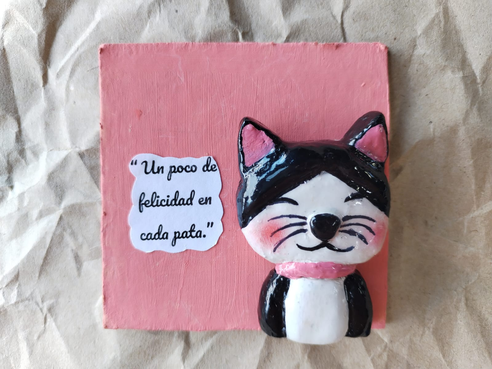
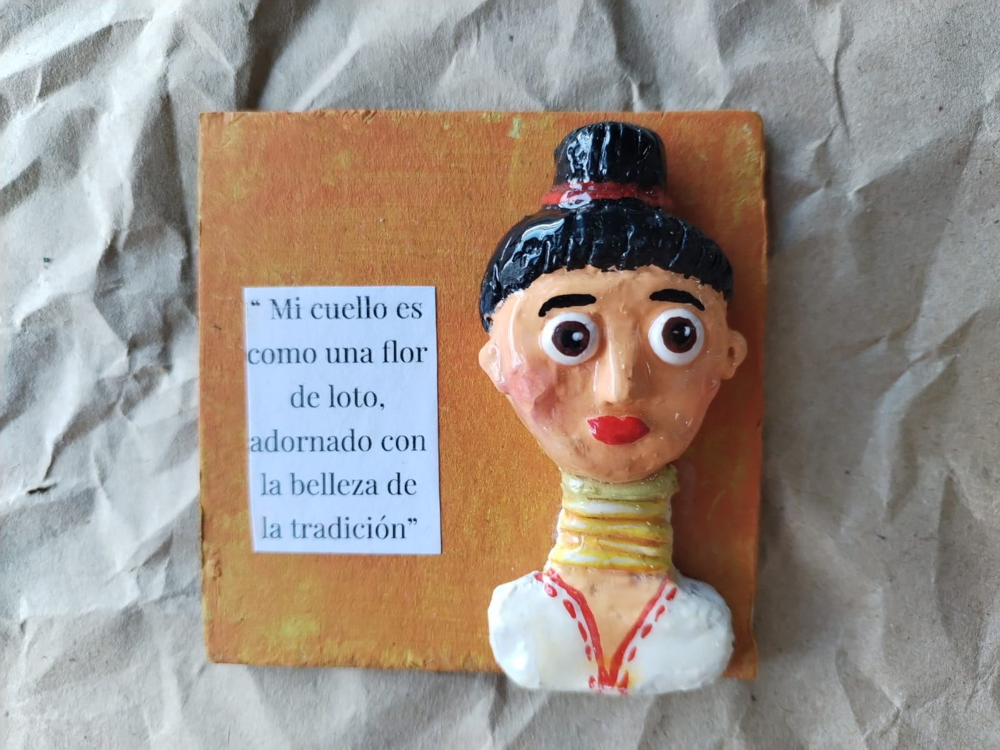
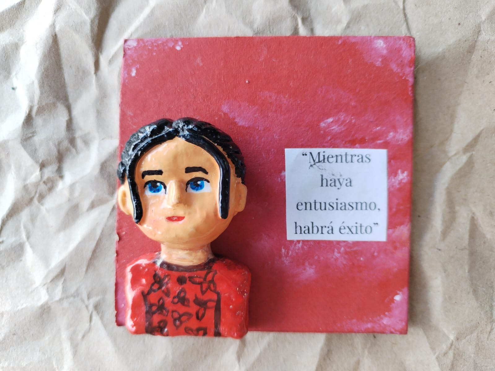
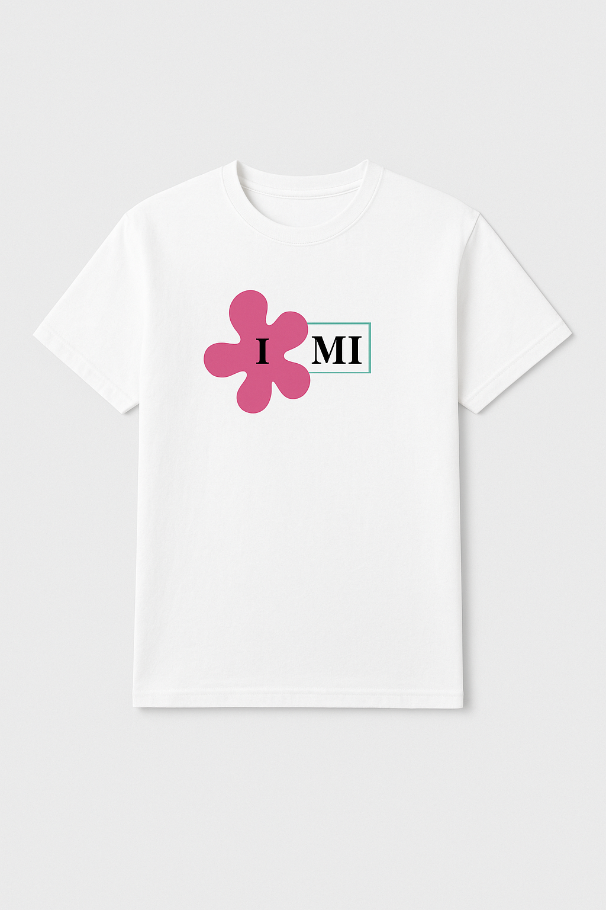
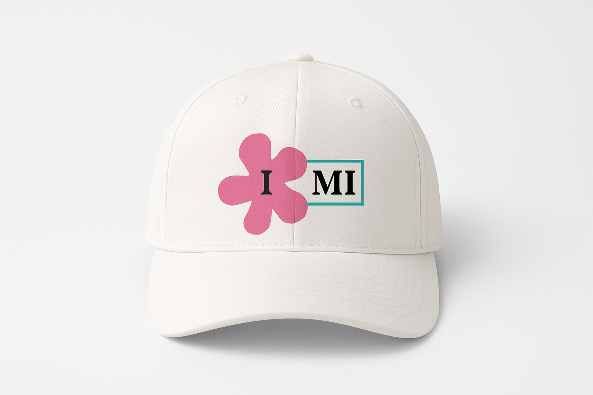
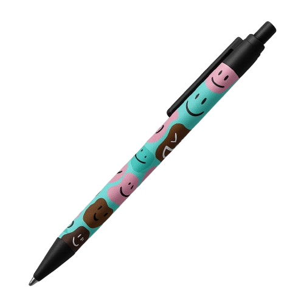

<html lang="es">
<head>
    <meta charset="UTF-8">
    <meta name="viewport" content="width=device-width, initial-scale=1.0">
    <title>Inspiración en Miniatura</title>
    
</head>
<body>
    <header>
        
 
        <h1>Inspiración en Miniatura</h1>
        
Cuadros en arcilla con mensajes motivacionales y personalizados

    </header>

    <nav>
        <a href="#productos">Productos</a>
        <a href="#personalizados">Personalizados</a>
        <a href="#mockup">Mockup</a>
        <a href="#contacto">Contáctanos</a>
    </nav>

    <section id="productos">
        <h2>Productos</h2>
        
Cada mini cuadro tiene un valor de $12.000. Aquí puedes ver algunos de nuestros diseños:

        

            

                
                <h3>Mensaje Positivo</h3>
                
$12.000

            

            

                
                <h3>Felicidad en Pequeño</h3>
                
$12.000

            

            

                
                <h3>Inspiración Diaria</h3>
                
$12.000

            

        

    </section>
    
  <section id="personalizados">
  <h2>Personaliza el tuyo</h2>
  
Si quieres un mensaje, una palabra o un diseño especial, rellena este formulario y nos pondremos en contacto contigo.

  
  

    <form onsubmit="event.preventDefault(); handleForm();">
      <label for="nombre">Nombre:</label>
      <input type="text" id="nombre" placeholder="Tu nombre" required />

      <label for="correo">Correo electrónico:</label>
      <input type="email" id="correo" placeholder="Tu correo electrónico" required />

      <label for="mensaje">Mensaje o indicaciones:</label>
      <input type="text" id="mensaje" placeholder="Ej: 'Para mamá', 'Ánimo'" required />

      <label for="referencia">Referencia o descripción de la idea:</label>
      <textarea id="referencia" rows="3" placeholder="Describe brevemente tu idea"></textarea>

      <button type="submit">Enviar solicitud — $12.000</button>
    </form>
  

</section>

<section id="mision-vision">
  <h2>Misión, Visión y Objetivos</h2>
  

    

      <h3>Misión</h3>
      

        Inspiración en Miniatura transforma la arcilla en pequeñas obras con mensajes positivos, promoviendo la creatividad, la gratitud y el amor por la cultura artesanal.
      

    

    

      <h3>Visión</h3>
      

        Ser un referente de emprendimiento artesanal en Ciudad Bolívar, inspirando a la comunidad educativa y local a través de mini cuadros en arcilla que conectan creatividad, emociones y patrimonio cultural de manera positiva y sostenible.
      

    

    

      <h3>Objetivos</h3>
      

        • Diseñar y elaborar mini cuadros en arcilla que inspiren a través de frases positivas.  
        • Experimentar con diferentes estilos y temáticas para diversificar las creaciones.  
        • Promover el arte artesanal como medio de comunicación emocional y cultural.
      

    

  

</section>

    <section id="mockup">
        <h2>Mockup del Emprendimiento</h2>
        
Aquí puedes ver algunos productos de la marca, como camisetas, Gorras y esferos.

        

            

                
                <h3>Camiseta</h3>
            

            

                
                <h3>Gorra</h3>
            

            

                
                <h3>Esfero</h3>
            

        

    </section>

    <section id="contacto">
        <h2>Contáctanos</h2>
        
Síguenos en nuestras redes sociales o escríbenos a nuestro correo electrónico.

        
<strong>Instagram:</strong> <a class="enlace" href="https://www.instagram.com/inspiracionenminiatura" target="_blank">@inspiracionenminiatura</a>

        
<strong>Correo:</strong> <a class="enlace" href="mailto:inspiracionenminiatura@gmail.com">inspiracionenminiatura@gmail.com</a>

    </section>

    <footer>
        
&copy; 2025 Inspiración en Miniatura - Todos los derechos reservados

    </footer>
</body>
</html>
